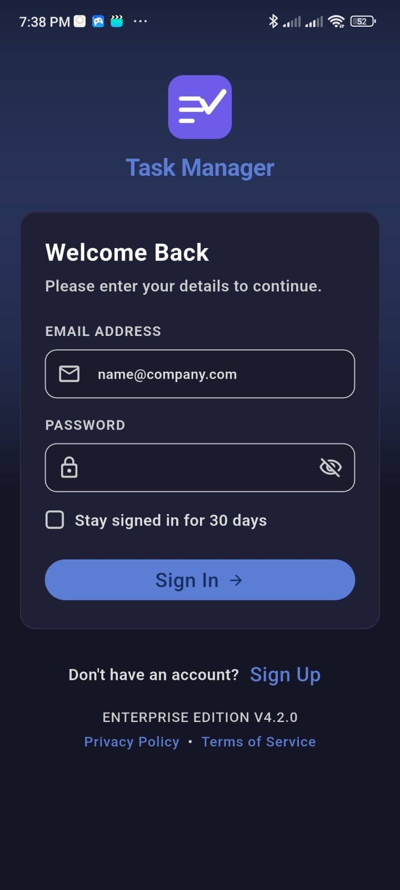
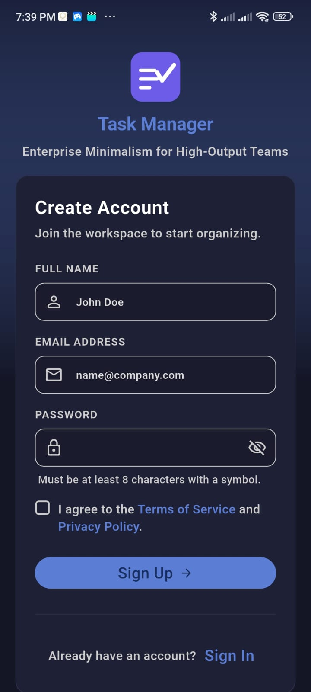
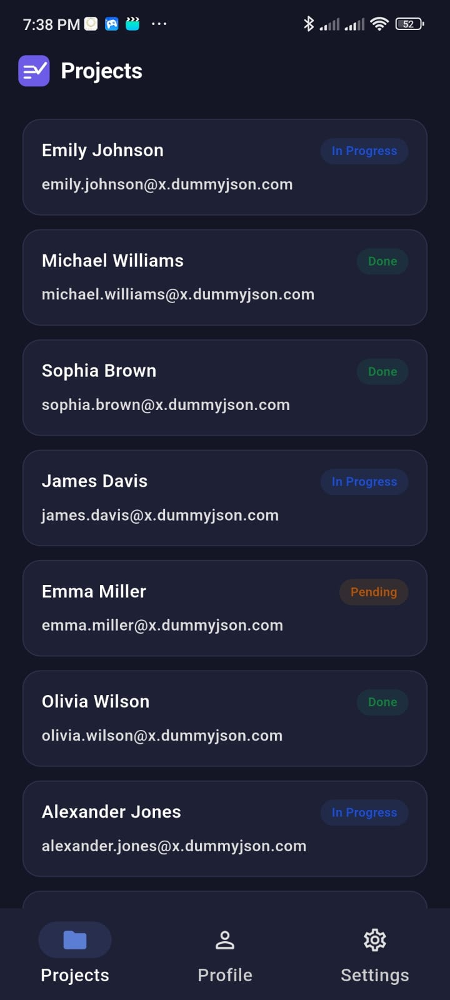
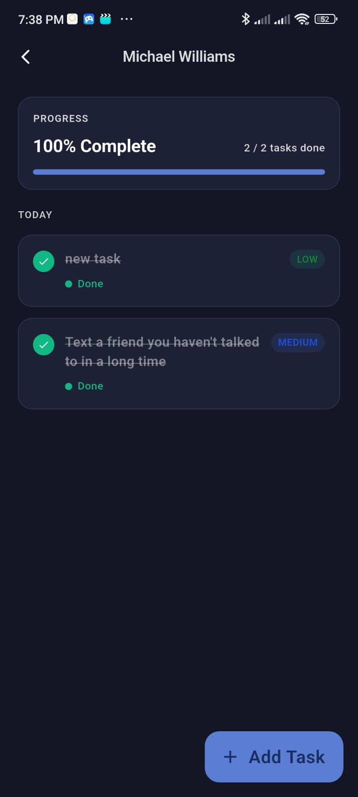
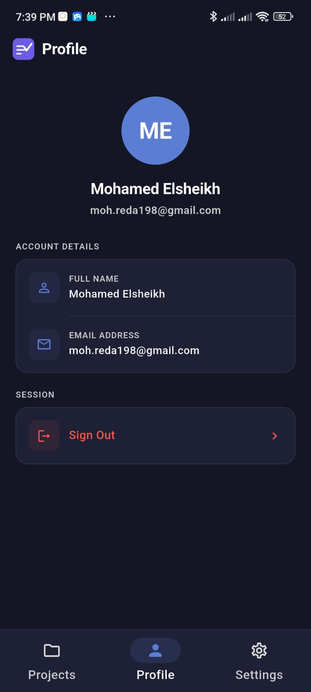
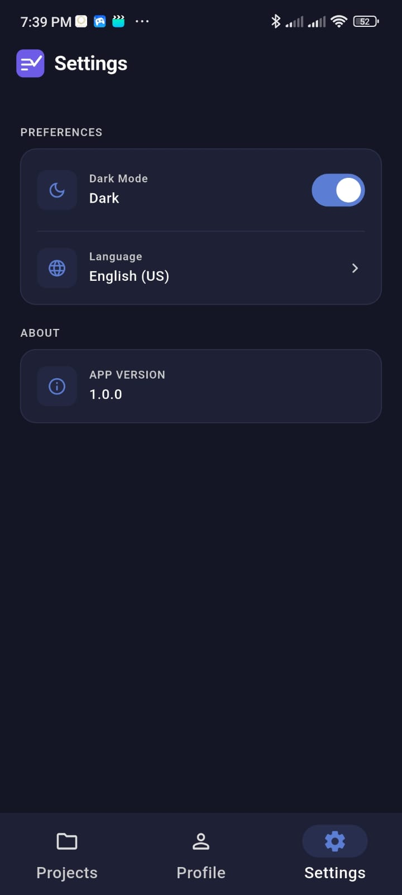

# ElectroPi Task Manager

A Flutter task management application built as a technical assessment for ElectroPi. The app allows users to authenticate, browse projects, manage tasks within those projects, and customize their experience with theme and language settings.

**API:** [DummyJSON](https://dummyjson.com) &nbsp;|&nbsp; **Platforms:** Android · iOS · Web · macOS · Linux · Windows

---

## Features

| Feature | Description |
|---|---|
| **Authentication** | Login and session persistence via token storage |
| **Projects** | Browse and view all projects with offline cache |
| **Tasks** | View, create, and update task status per project |
| **Profile** | View authenticated user profile |
| **Settings** | Toggle light/dark/system theme and switch language |
| **Localization** | Full English and Arabic (RTL) support |
| **Offline Support** | Hive-backed cache-aside layer for projects and tasks |
| **Connectivity Banner** | Real-time offline/online indicator |

---

## Screenshots

<table>
  <tr>
    <td align="center"><b>Login</b></td>
    <td align="center"><b>Register</b></td>
    <td align="center"><b>Projects</b></td>
  </tr>
  <tr>
    <td></td>
    <td></td>
    <td></td>
  </tr>
  <tr>
    <td align="center"><b>Project Details & Tasks</b></td>
    <td align="center"><b>Profile</b></td>
    <td align="center"><b>Settings</b></td>
  </tr>
  <tr>
    <td></td>
    <td></td>
    <td></td>
  </tr>
</table>

---

## Architecture

The project follows **Clean Architecture** with strict layer separation:

```
Presentation  →  Domain  →  Data
(Cubits/UI)     (UseCases)   (Repos/APIs/Cache)
```

```
lib/
├── core/
│   ├── cache/          # Hive cache client
│   ├── constants/      # API constants
│   ├── di/             # GetIt dependency injection setup
│   ├── error/          # Failure classes
│   ├── extensions/     # Dart/Flutter extensions
│   ├── language/       # Generated ARB localizations (S class)
│   ├── network/        # Dio API client
│   ├── router/         # GoRouter navigation
│   ├── storage/        # Token storage (SharedPreferences)
│   ├── theming/        # Light/dark theme definitions
│   └── widgets/        # Shared UI components
└── features/
    ├── auth/           # Login, session management
    ├── projects/       # Project list and detail
    ├── tasks/          # Task list, creation, status update
    ├── profile/        # User profile
    ├── settings/       # Theme and language preferences
    ├── splash/         # App initialization and routing
    └── localization/   # Language switching (LangCubit)
```

**Key decisions:**
- State management: **Cubit/Bloc** only — no Riverpod, Provider, or GetX
- Dependency injection: **GetIt** service locator registered in `core/di/`
- Navigation: **GoRouter** with typed route parameters
- No code generation: uses Dart 3+ `sealed class` and `switch` expressions instead of Freezed

---

## Prerequisites

- [Flutter SDK](https://flutter.dev/docs/get-started/install) `>=3.11.5`
- Dart `>=3.11.5`
- Android Studio / Xcode (for mobile targets)

---

## How to Run

```bash
# 1. Clone the repository
git clone <repo-url>
cd electro_pi_task_manager

# 2. Install dependencies
flutter pub get

# 3. Run on a connected device or emulator
flutter run

# Run on a specific platform
flutter run -d android
flutter run -d ios
flutter run -d chrome          # Web
flutter run -d windows         # Windows desktop
```

### Build for Production

```bash
flutter build apk              # Android APK
flutter build appbundle        # Android App Bundle
flutter build ios              # iOS (requires macOS + Xcode)
flutter build web              # Web
flutter build windows          # Windows
```

### Run Tests

```bash
flutter test
```

---

## Dependencies

### Runtime

| Package | Version | Purpose |
|---|---|---|
| `flutter_bloc` | ^9.0.0 | State management (Cubit/Bloc) |
| `get_it` | ^8.0.3 | Dependency injection / service locator |
| `go_router` | ^15.1.2 | Navigation and routing |
| `dio` | ^5.8.0 | HTTP client |
| `hive_flutter` | ^1.1.0 | Local cache / offline storage |
| `shared_preferences` | ^2.3.5 | Persistent key-value storage |
| `connectivity_plus` | ^6.0.5 | Network connectivity monitoring |
| `flutter_screenutil` | ^5.9.3 | Responsive UI scaling (design: 402×874 dp) |
| `equatable` | ^2.0.7 | Value equality for domain models |
| `shimmer` | ^3.0.0 | Loading skeleton UI |
| `toastification` | ^2.3.0 | In-app toast notifications |
| `intl` | ^0.20.2 | Internationalization (i18n) |
| `flutter_localizations` | SDK | Localization delegates |
| `cupertino_icons` | ^1.0.8 | iOS-style icons |

### Dev

| Package | Version | Purpose |
|---|---|---|
| `flutter_test` | SDK | Flutter testing framework |
| `bloc_test` | ^10.0.0 | Cubit/Bloc unit test helpers |
| `mocktail` | ^1.0.4 | Mocking for unit tests |
| `flutter_lints` | ^6.0.0 | Lint rules |
| `flutter_launcher_icons` | ^0.14.3 | App icon generation |

---

## Localization

The app supports **English** and **Arabic** (with full RTL layout). Language can be switched at runtime from the Settings screen.

Localization strings live in `lib/core/language/` as ARB files. To add a new language:

1. Add a new ARB file (e.g., `app_fr.arb`)
2. Run `flutter pub run intl_utils:generate`
3. Register the locale in `LangService`

---

## Configuration

The API base URL is defined in `lib/core/constants/api_constants.dart`:

```dart
static const String baseUrl = 'https://dummyjson.com';
```

No environment file is required — all configuration is compile-time constants.
